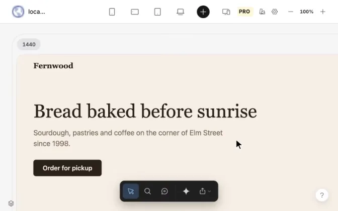

# PixelPrism

## Your app is your canvas.

**A visual editor for the web app you're building.** Open your running app, refine the interface in the browser, and hand precise changes to your coding agent to implement in the source code.

PixelPrism is a Chrome extension that works with the rendered page, regardless of its framework or which coding agent or harness you use. Designers and developers can work on the real layout and behavior of their app.

### Make the interface feel right

- **Edit the real UI.** Select an element and adjust its typography, colors, spacing, layout, borders and more. See each change in the preview as you work.
- **Check every screen size.** View phone, tablet and desktop side by side. Open tabs and menus, compare Hover, Focus and Pressed states, and see how the layout responds.
- **Keep feedback in context.** Pin comments to elements at a specific screen size and keep track of your visual edits.
- **Hand off exact changes.** Copy a structured task for any coding agent, or export an HTML or PDF review with screenshots, comments and before/after values.

### From browser to code

1. Open your app from the PixelPrism icon. It appears at several screen sizes.
2. Make visual edits and leave notes on the running interface.
3. Copy the changes to your coding agent, then check its work in PixelPrism.

## Install

1. Download and unzip the PixelPrism extension archive.
2. Open `chrome://extensions` and enable **Developer mode**.
3. Choose **Load unpacked** and select the extracted PixelPrism folder.
4. Open your app and click the PixelPrism icon.

To open local `file:///` pages, enable **Allow access to file URLs** in the extension's details.

## What to know

- PixelPrism works with apps on localhost, staging, preview deployments and production sites that allow iframe embedding. Pages that block embedding cannot open in Studio.
- Visual edits stay in PixelPrism until a coding agent applies them to your project. You can also save edits explicitly to a local HTML file.
- Screenshots capture the live site without unsaved CSS preview edits.
- Comments and edits stay in your browser. No account or backend is required.

Chrome asks for permission to open pages in Studio, read their styles and save screenshots and reviews. Capture uses Chrome's debugger temporarily, so you may see a debugging notice.
